# My Homelab Deep Dive

A complete walkthrough of my homelab in 2026.
Full write-up on Medium for my 2025 homelab overview: is available on medium -  [Why I Built a Home Lab and What I'm Self-Hosting](https://medium.com/@peter_kinyua/why-i-built-a-home-lab-and-whats-i-am-self-hosting-4b7c75b84c09)

---

## Table of Contents

- [The Journey](#the-journey)
  - [Where This All Started](#where-this-all-started)
  - [Evolution](#evolution)
  - [Hardware Deep Cuts](#hardware-deep-cuts)
- [Networking](#networking)
  - [Networking is the Foundation](#networking-is-the-foundation)
  - [Two Design Patterns](#two-design-patterns)
  - [Pattern A — VLAN-only](#pattern-a--vlan-only)
  - [Pattern B — OpenFabric + EVPN](#pattern-b--openfabric--evpn)
  - [My Setup — WiFi, VLANs, DNS and DHCP](#my-setup--wifi-vlans-dns-and-dhcp)
  - [Wired and Wireless Network Design](#wired-and-wireless-network-design)
  - [Proxmox Networking Primitives](#proxmox-networking-primitives)
  - [The Fusion Cluster](#the-fusion-cluster)
- [Compute — Hypervisors](#compute--hypervisors)
  - [Why Proxmox](#why-proxmox)
  - [What a 3-Node Cluster Gives You](#what-a-3-node-cluster-gives-you)
- [Virtualization](#virtualization)
  - [The Spectrum](#the-spectrum)
  - [How I Mix Them](#how-i-mix-them)
- [GitOps and Automation](#gitops-and-automation)
  - [GitOps](#gitops)
  - [The Pipeline](#the-pipeline)
  - [Automation Tools](#automation-tools)
- [IoT and Home Automation](#iot-and-home-automation)
- [Observability](#observability)
  - [Observability Matrix — InfluxDB + Telegraf Path](#observability-matrix--influxdb--telegraf-path)
  - [Observability Matrix — Prometheus Path](#observability-matrix--prometheus-path)
- [Selfhosting](#Selfhosting)
  - [Why This Matters ](#why-this-matters)
- [For Network Engineers](#for-network-engineers)
  - [Network Sandboxes and Emulators](#network-sandboxes-and-emulators)
  - [Open Source NMS Tools](#open-source-nms-tools)
  - [Observability Tools for Networking](#observability-tools-for-networking)
- [Learning Roadmap](#learning-roadmap)
- [Takeaways](#takeaways)

---

## The Journey

### Where This All Started

A used gaming laptop, CasaOS, and a single goal: stop paying for cloud storage.

A home lab is a personal playground where you experiment with compute, networking, and storage without the risk of taking down production. Mine started as a simple hobby. These days it runs services I depend on daily and serves as the most useful technical training environment I have had — more useful than any course, more useful than most jobs.

I work in networking. I have had my fill of CLI-only setups professionally. At home I wanted a system I could break intentionally, rebuild from Git, and understand at every layer. That instinct — build it, break it, understand why — is the whole point.

---

### Evolution

The lab grew through four distinct phases. Each one unlocked a new category of understanding.

| Phase | What it was | What I learned |
|---|---|---|
| 01 — The gaming laptop | CasaOS, Docker, first self-hosted apps | Linux basics, SSH, port forwarding, reverse proxies, Docker |
| 02 — Mini PCs + small rack | Two or three mini PCs, a managed switch, a tiny rack | VLANs, subnets, static DHCP, firewall rules |
| 03 — Threadripper added | Real CPU, real RAM, PCIe lanes. Hardware became interesting | Bifurcation, NICs, GPU passthrough |
| 04 — 12U rack, full UniFi stack | Proxmox cluster, UniFi gateway and switches, UPS, NAS | Clustering, SDN, automation, production mentality |

At the heart of the lab sits a Rivco 16U server rack and a Geek-Pi mini rack. The Lenovo ThinkStation P620 (AMD Threadripper Pro 3945WX) is the powerhouse — virtualisation, storage, orchestration. A Firebat mini PC runs Linux Mint in kiosk mode as a dedicated metrics dashboard. Three mini PCs in a proxmox cluster. A UNAS Pro NAS handles storage and backups.

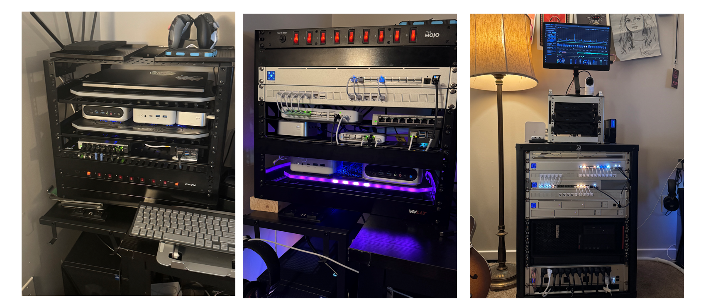

---

### Hardware Deep Cuts

What the YouTube build videos don't mention.

**Heat and noise**

Datacenter gear is loud. You need to plan thermals and noise mitigation before you buy — airflow, dust control, and undervolting are not optional. My lab doubles as my office, and while the Threadripper and mini PC cluster produce noticeable heat even at idle, it's still very manageable thanks to how efficient mini PCs are.

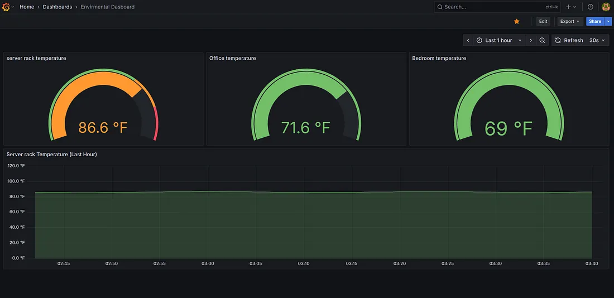
 > Lab temp dashboard

**Power — the silent monthly bill**

More compute means a bigger power bill. Idle draw matters more than peak — a homelab is idle 95% of the time. Use a smart plug (Tapo, Shelly) to measure each box before committing. Old Xeons may look free on eBay, but a 250W idle box will out-cost a new mini PC within months. I track power consumption per host via smart plugs feeding into Grafana.

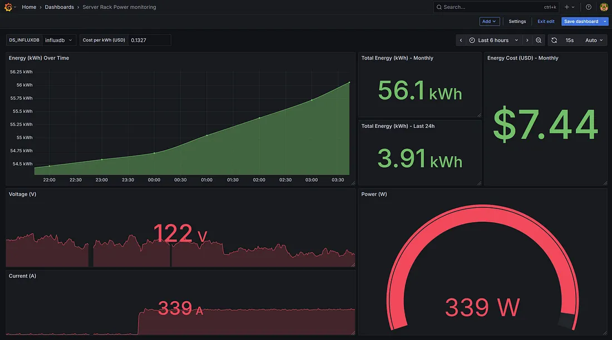

**Size matters**

When it comes to rack space, you'll always need more than you planned for. I learned that the hard way with my first rack… and somehow repeated it with the second. Pay attention to the real constraints early: rack units, depth, weight, and cabling. A short-depth 12U works well for a home lab, but a full-depth 42U can quickly become impractical — sometimes it won't even fit through the doorways that define your space.

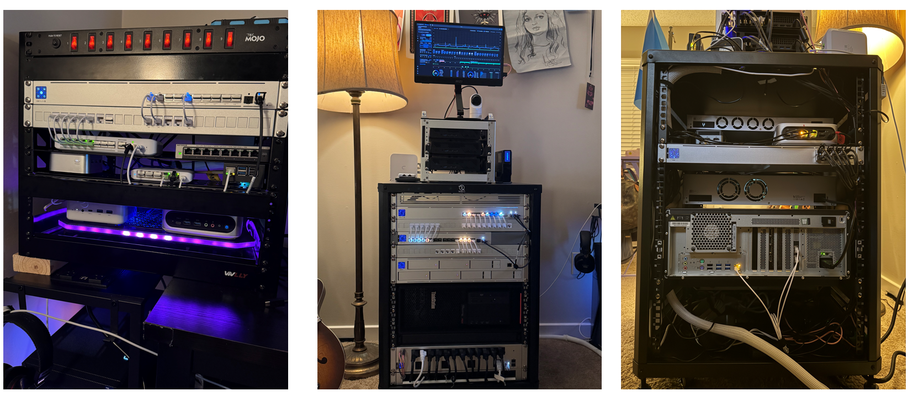
 > My poor planning on display 

**Room for expansion — PCIe lanes, rack size**

The thing you'll regret in 6 months: not counting PCIe lanes early. NICs, NVMe drives, and GPUs all compete for the same bandwidth.

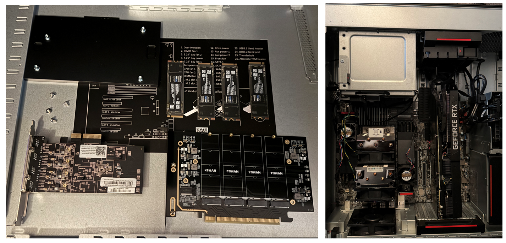

---

## Networking

### Networking is the Foundation

A homelab is a stack. Each layer assumes the one below it works. Networking is the bottom — not the topping.
                   
 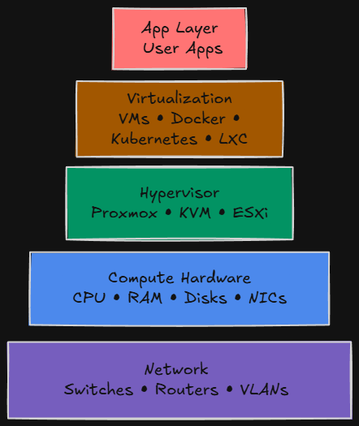
> Layer in a homelab set up 

Read it bottom-up. Every networking problem presents itself elsewhere first — as a DNS timeout, as a VM that won't talk to another VLAN, as a mysterious 30-second delay. The faster I learned to read the network layer, the faster everything else started making sense.

---

### Two Design Patterns

Two patterns cover most of what I use in my homelab network:

a. Pattern A — VLANs only
b. Pattern B — OpenFabric + EVPN — overkill for a homelab

### Pattern A — VLAN-only

One switch. One trunk. Tags carry the segmentation. The pattern most homelabs run.

- Single LAN switch, trunk ports
- VLAN tags carry segmentation
- Router does inter-VLAN routing
- Switch is the single point of failure

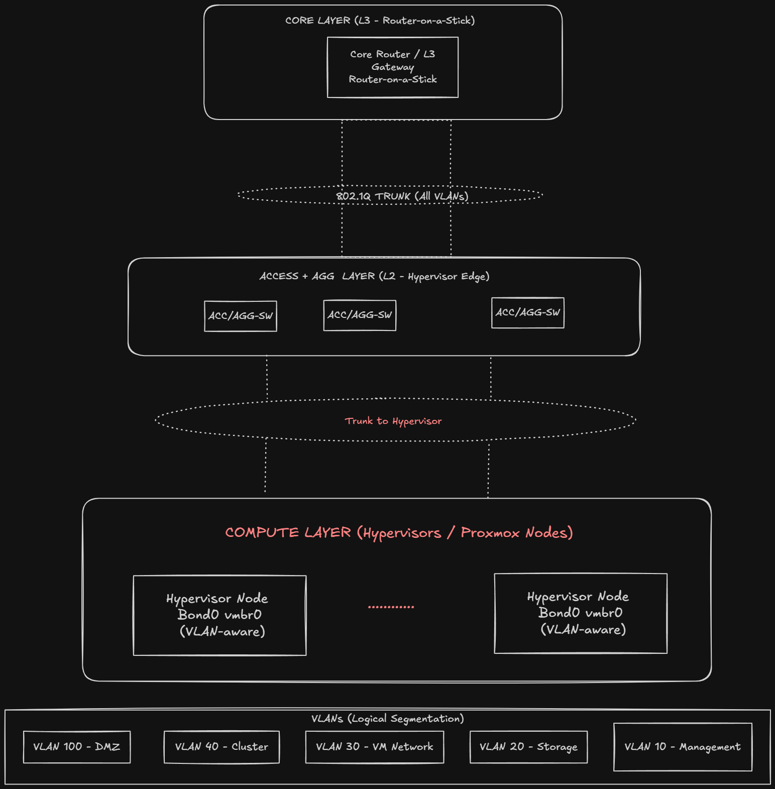
> Pattern A - Vlan only 


### Pattern B — OpenFabric + EVPN

Each node is a VTEP. EVPN/BGP carries reachability. VXLAN encapsulates tenant L2 over a routed mesh.

- Routed underlay between every node
- EVPN distributes MAC and IP info via BGP
- VXLAN encapsulates tenant L2 over L3
- Self-healing — link failure auto-reroutes

My fusion cluster runs this in production over a Thunderbolt 4 full-mesh ring. Three nodes, three `/30` point-to-point links. OpenFabric instance `tb-fab` runs in FRR on each node, distributes loopback `/32` reachability, and ECMP load-balances across the two available paths. iBGP AS 65000 carries L2VPN EVPN with `advertise-all-vni`. `vxlan_vnet100` (VNI 100) handles L2 between VMs. `vrfvx_vmzone` (VNI 10000) handles L3 routing between subnets.

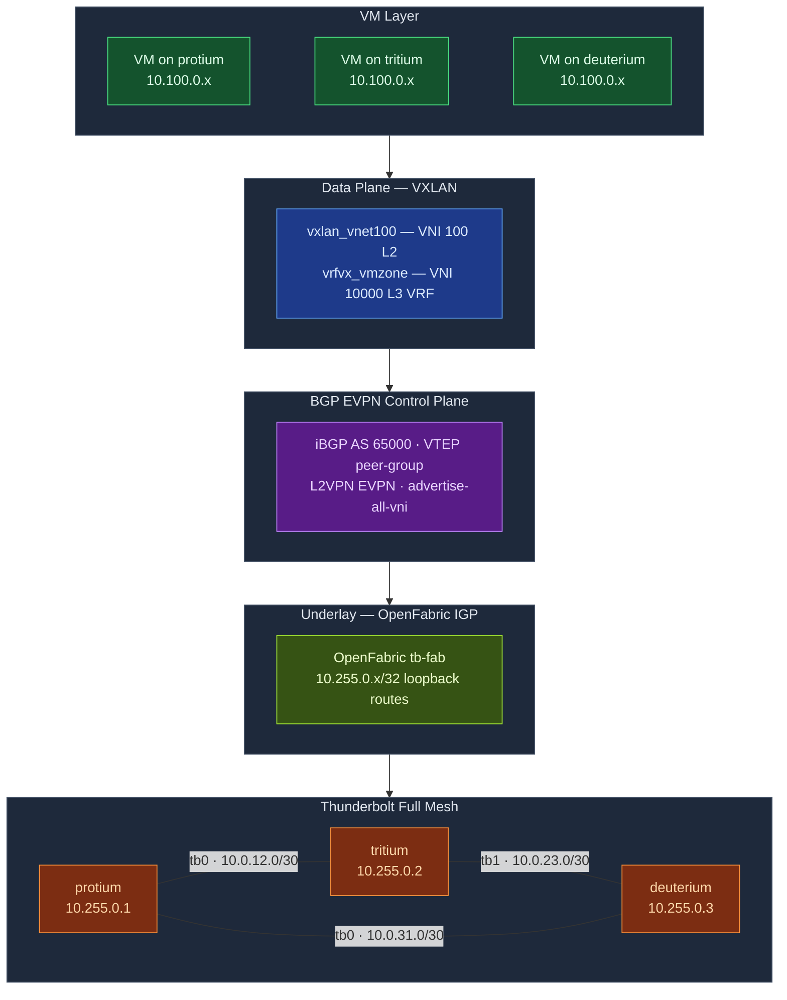
```mermaid
graph TB
    subgraph VMs["VM Layer"]
        VM1[VM on protium<br/>10.100.0.x]
        VM2[VM on tritium<br/>10.100.0.x]
        VM3[VM on deuterium<br/>10.100.0.x]
        VM1 ~~~ VM2 ~~~ VM3
    end

    subgraph DataPlane["Data Plane — VXLAN"]
        VX[vxlan_vnet100 — VNI 100 L2<br/>vrfvx_vmzone — VNI 10000 L3 VRF]
    end

    subgraph Overlay["BGP EVPN Control Plane"]
        BGP[iBGP AS 65000 · VTEP peer-group<br/>L2VPN EVPN · advertise-all-vni]
    end

    subgraph Underlay["Underlay — OpenFabric IGP"]
        OF[OpenFabric tb-fab<br/>10.255.0.x/32 loopback routes]
    end

    subgraph Physical["Thunderbolt Full Mesh"]
        P[protium<br/>10.255.0.1]
        T[tritium<br/>10.255.0.2]
        D[deuterium<br/>10.255.0.3]
        P ---|tb0 · 10.0.12.0/30| T
        T ---|tb1 · 10.0.23.0/30| D
        D ---|tb0 · 10.0.31.0/30| P
    end

    VMs --> DataPlane
    DataPlane --> Overlay
    Overlay --> Underlay
    Underlay --> Physical

    style P fill:#7c2d12,stroke:#fb923c,color:#fed7aa
    style T fill:#7c2d12,stroke:#fb923c,color:#fed7aa
    style D fill:#7c2d12,stroke:#fb923c,color:#fed7aa

    style OF fill:#365314,stroke:#a3e635,color:#ecfccb
    style BGP fill:#581c87,stroke:#c084fc,color:#e9d5ff
    style VX fill:#1e3a8a,stroke:#60a5fa,color:#dbeafe

    style VM1 fill:#14532d,stroke:#4ade80,color:#dcfce7
    style VM2 fill:#14532d,stroke:#4ade80,color:#dcfce7
    style VM3 fill:#14532d,stroke:#4ade80,color:#dcfce7

    style VMs fill:#1e293b,stroke:#475569,color:#e2e8f0
    style DataPlane fill:#1e293b,stroke:#475569,color:#e2e8f0
    style Overlay fill:#1e293b,stroke:#475569,color:#e2e8f0
    style Underlay fill:#1e293b,stroke:#475569,color:#e2e8f0
    style Physical fill:#1e293b,stroke:#475569,color:#e2e8f0
```
> Pattern B - Proxmox SDN - EVPN+ open fabric


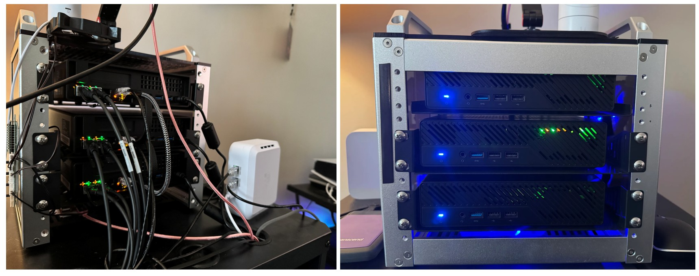

 > Fusion cluster - Proxmox cluster over thunderbolt 

**Thunderbolt throughput — iperf3 over the fabric**

Testing loopback-to-loopback measures exactly what real workloads experience. The outer addresses are routed by OpenFabric; traffic travels over Thunderbolt interfaces.

```bash
# server on deuterium — binds to loopback
iperf3 -s -B 10.255.0.3 -1 -D

# client on tritium — 4 parallel streams
iperf3 -c 10.255.0.3 -B 10.255.0.2 -t 30 -P 4
```

Result: **~18.3 Gbps sustained**, 4 parallel streams, zero retransmits, over 30 seconds.


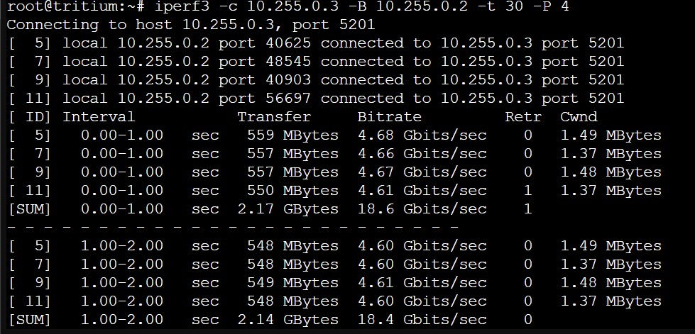
 > iperf test results

---

### My Setup — WiFi, VLANs, DNS, DHCP and Reverse Proxies

| Component | Role |
|---|---|
|  [Technitium DNS](https://technitium.com) | Primary DNS. Authoritative + recursive. Native split-horizon, conditional forwarding, DNS-over-HTTPS, custom internal zones |
|  [Traefik Proxy](https://traefik.io/) | My go-to reverse proxy |
|  [UniFi DHCP](https://ui.com) | Per-VLAN scopes, static reservations |
|  [UniFi Controller](https://ui.com) | Network brain — switch and AP config, firewall rules, traffic ID, VPN endpoints |

VLANs:

| ID | Name | Purpose |
|---|---|---|
| 10 | APPS | Self-hosted application VMs |
| 11 | MGMT | Management plane — Proxmox, UniFi, out-of-band access |
| 30 | IOT | Home Assistant, smart plugs, sensors |
| 40 | K3S | k3s cluster nodes |
| 100 | K8S | Full Kubernetes cluster nodes |
| 200 | LB | MetalLB / load balancer address pool |


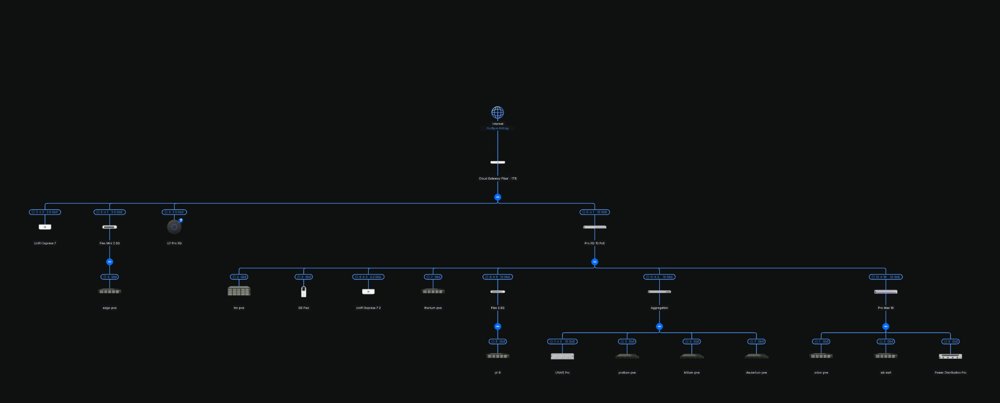

 > My network topology - unifi design center
---

### Wired and Wireless Network Design

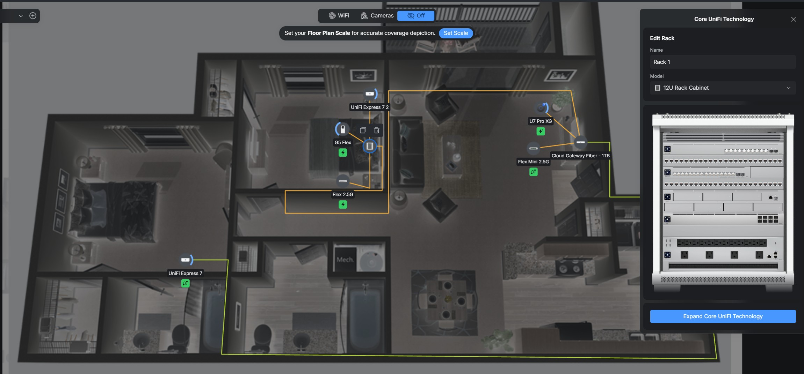

> Physical switch connections and uplinks

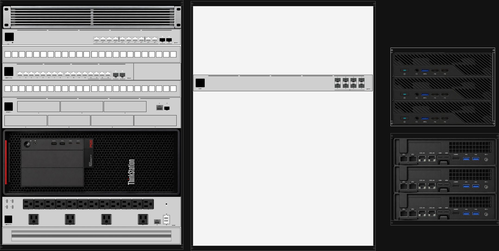

> Rack layouts 

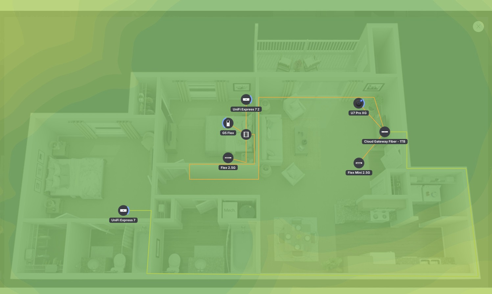

> 2.4 GHz AP placement and coverage

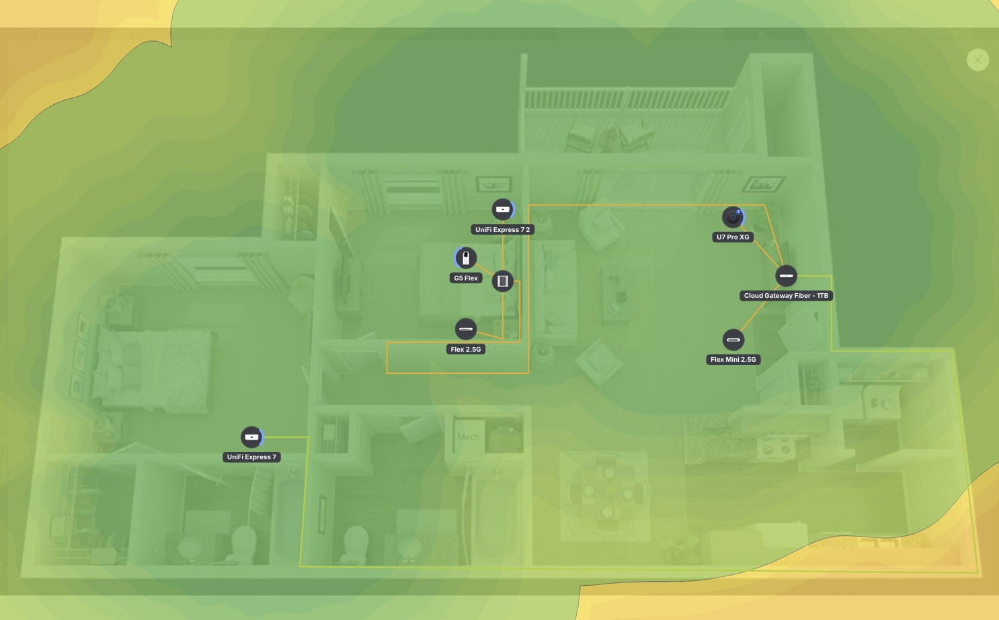

> 5 GHz AP placement and coverage

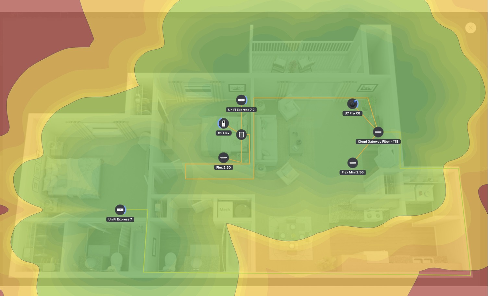

> 6 GHz AP placement and coverage

---

### Proxmox Networking Primitives

Three constructs explain everything about how VMs connect to physical networks in a Proxmox cluster.

**vmbr — Linux bridge**

A virtual switch inside the host. VMs attach to it and get switched to physical interfaces. VLAN-aware bridges pass 802.1Q tags through to the VM.

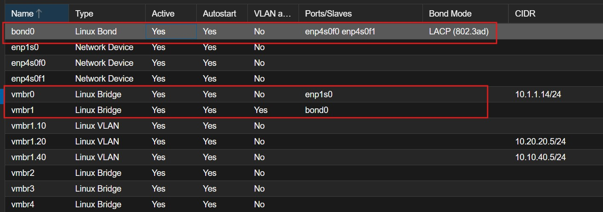
  > Linux bridge and bond

```bash
auto vmbr0
iface vmbr0 inet static
  bridge-ports eno1
  bridge-vlan-aware yes
  bridge-vids 2-4094
```

**bond — link aggregation**

Two or more NICs treated as one. LACP for redundancy and bandwidth. Active-backup for switchs with  LACP capabilities. Sits underneath the bridge.

```bash
auto bond0
iface bond0 inet manual
  bond-slaves eno1 eno2
  bond-mode 802.3ad
  bond-miimon 100
```

**FRR — routing daemon**

BGP, OSPF, IS-IS, OpenFabric, EVPN — all running in userspace on the Proxmox host. Turns  hypervisor into a router. Required for SDN EVPN zones.

```text
router bgp 65000
 neighbor 10.0.0.2 remote-as 65000
 neighbor 10.0.0.2 update-source lo
!
router openfabric 1
 net 49.0001.0000.0000.0001.00
```

---

### The Fusion Cluster

I have a three-mini-PC cluster named after isotopes of hydrogen: protium, tritium, deuterium.

| Feature | Cluster capabilities |
|---|---|
| HA and failover | VM dies on one node, restarts on another within seconds |
| Live migration | Move a running VM between nodes with no downtime |
| Ceph storage | Distributed block storage — survive single-disk and single-node failures |
| SDN — EVPN zones | Tenant networks across the cluster, anycast gateways, multi-tenancy without VLANs |

---

## Compute — Hypervisors

### Why Proxmox

 [Proxmox VE](https://www.proxmox.com/en/proxmox-virtual-environment/overview)

| Reason | Detail |
|---|---|
| Open source, no licensing | Free for homelabs. Paid support exists for production |
| KVM + LXC in one tool | Full VMs and lightweight containers from the same UI |
| Real cluster features | HA, live migration, Ceph, shared storage — all built-in |
| Proxmox SDN | EVPN zones, VXLAN, anycast gateways — without buying NSX |
| API for everything | Terraform provider, Ansible modules, full automation surface |

The API-first design is the deciding factor for a GitOps workflow. Every VM, network, and storage object has a corresponding API endpoint. Terraform's `bpg/proxmox` provider and Ansible's `community.general.proxmox` modules treat the cluster as code.


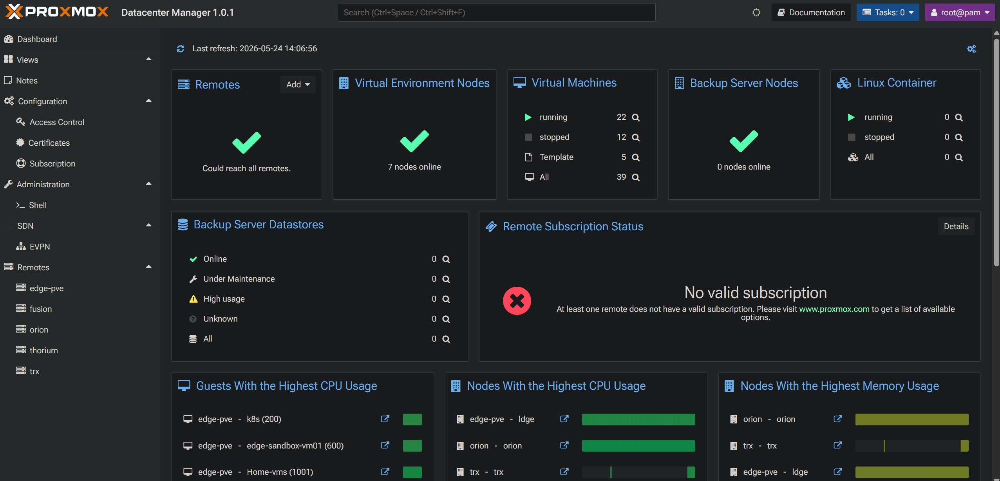
  > proxmox data center manger - all pve nodes on one UI

---

### What a 3-Node Cluster Gives You

| Capability | How it works |
|---|---|
| HA and failover | VM dies on one node, restarts on another within seconds |
| Live migration | Move a running VM between nodes with no downtime. Maintenance windows during business hours |
| Ceph storage | Distributed block storage across all nodes. Survive single-disk and single-node failures |
| SDN — EVPN zones | Tenant networks across the cluster, anycast gateways, multi-tenancy without VLANs |

---

## Virtualization

### The Spectrum

The same workload sometimes works in any runtime. The right answer is rarely "use only one." In my homelab I  end up running all three because each one is best at something different.

| Runtime | Best for | Trade-off |
|---|---|---|
| Full VMs (KVM) | Stateful infra — NetBox, GitLab, Home Assistant | Per-VM kernel, strong isolation, higher overhead |
|  [Docker](https://docker.com) | Most apps — arr stack, Traefik, Atlantis | Shared kernel, composable, image-based |
|  [k3s](https://k3s.io) / [microk8s](https://microk8s.io) | Learning Kubernetes, GitOps practice | Lightweight, real K8s API, Cilium or Flannel CNI |
|  [Full K8s (kubeadm)](https://kubernetes.io) | Production prep, HA control planes | More moving parts, etcd, dedicated control plane nodes |

---

### How I Mix Them

| Runtime | What runs on it | Mindset |
|---|---|---|
| Proxmox VMs | NetBox, GitLab, Home Assistant, Pi-hole, Technitium, long-lived stateful services | Hosts for Docker and Kubernetes |
| Docker Compose | Traefik, arr stack (Sonarr, Radarr, Lidarr, Bazarr), Jellyfin, Atlantis | Most app workloads |
| k3s cluster | ArgoCD, Gitea, Cilium with BGP, Gateway API + cert-manager | GitOps CI/CD workflows |

**VM setup — templating and provisioning**

VMs are created from cloud-init templates, not installed manually. Prebuilt base image template. Terraform provisions the VM from it. Ansible configures the application layer on top.

**Docker setup — Portainer**

 [Portainer](https://www.portainer.io) manages Docker Compose stacks across hosts. Each stack lives in its own folder in this repo under `/virtualization/docker/` and `/media/arr-stack/`.

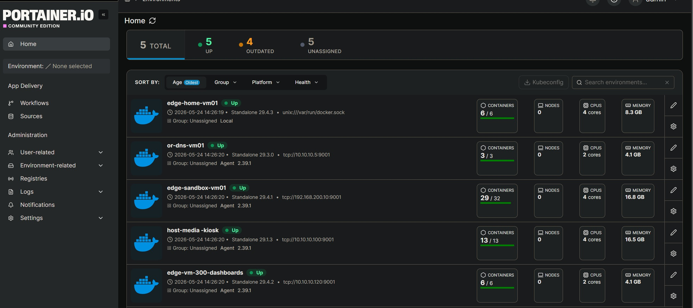

 > Portainer UI 

**Kubernetes setup — HA Kubernetes and standalone Cilium k3s**

Two ways I run Kubernetes environments in my home lab:

- Standalone k3s clusters with Cilium CNI and BGP control plane, Gateway API CRDs, and cert-manager for wildcard TLS via Cloudflare DNS-01
- A multi-node HA kubeadm cluster for production-pattern practice with etcd, dedicated control planes, and worker nodes

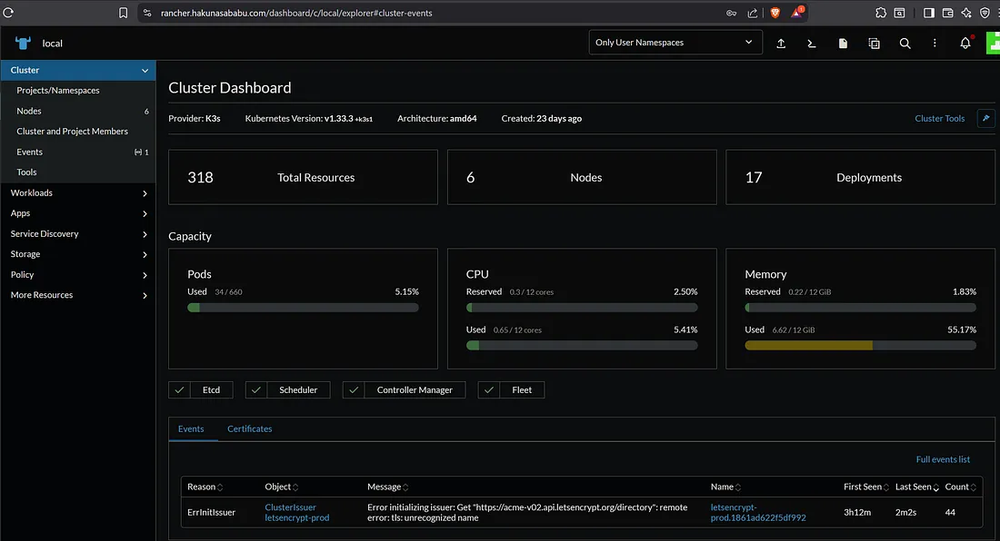
 > HA Kubernetes Rancher dashboard

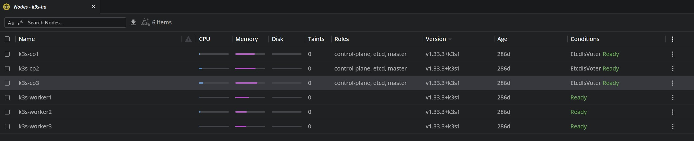
> HA Kubernetes nodes


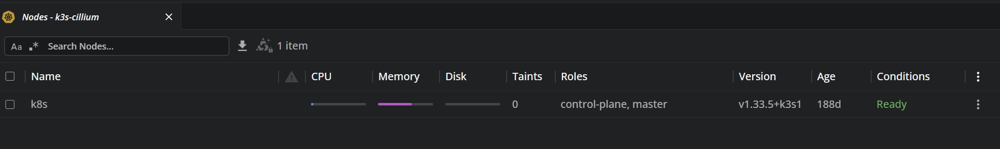
 > k3s with Cilium CNI node 


---

## GitOps and Automation

### GitOps

My lab runs a full GitOps loop. Every application change starts as a commit. Every infrastructure change starts as a merge request. Nothing is clicked into existence and left undocumented.

 [GitLab CE](https://about.gitlab.com) is the source of truth for all code: application manifests, Terraform modules, Ansible playbooks, Kestra flow definitions, and Helm values. A push to the main branch triggers a CI pipeline.

 [ArgoCD](https://argo-cd.readthedocs.io) runs in the k3s cluster and watches the GitLab repo. When a Kubernetes manifest changes, ArgoCD detects the drift and reconciles — the cluster converges to what Git says without manual intervention.

 [Harbor](https://goharbor.io) serves as the private container registry. Docker images built in GitLab CI are pushed to Harbor, and ArgoCD pulls from Harbor when deploying to the cluster.

**A working example — deploying an app through the full pipeline:**

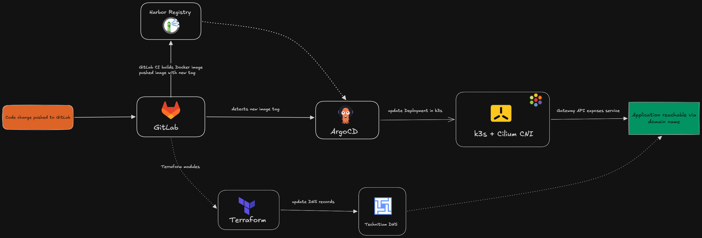
  > Full CICD pipeline

The same pipeline runs for any containerised app. Write the Dockerfile and the Kubernetes manifest, push — the rest is automated.

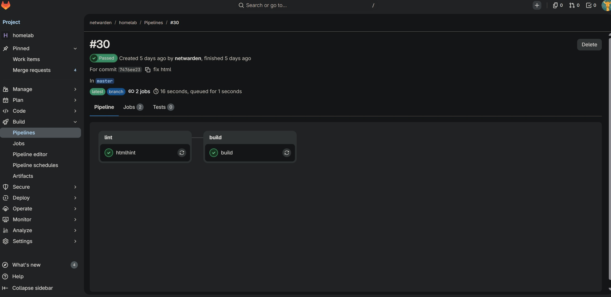
  > Gitlab  CI

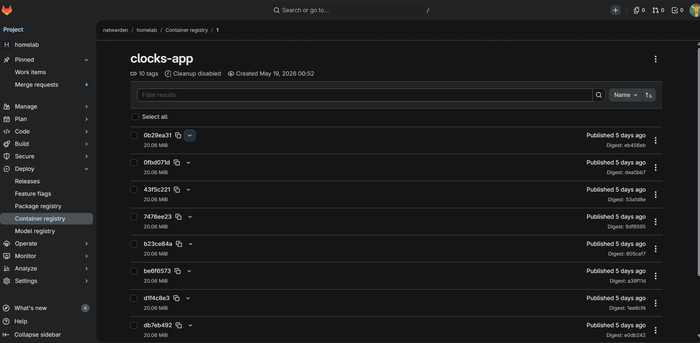
> Gitlab  registry


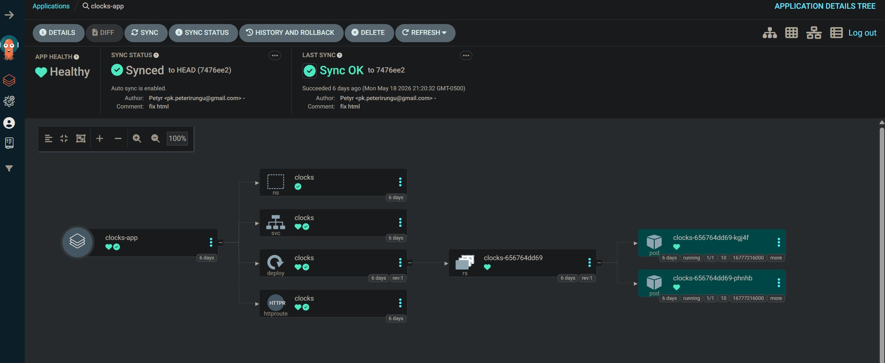

  > argocd  CD 

---

### The Pipeline

Git as source of truth. NetBox as desired state. Each tool does one thing well.

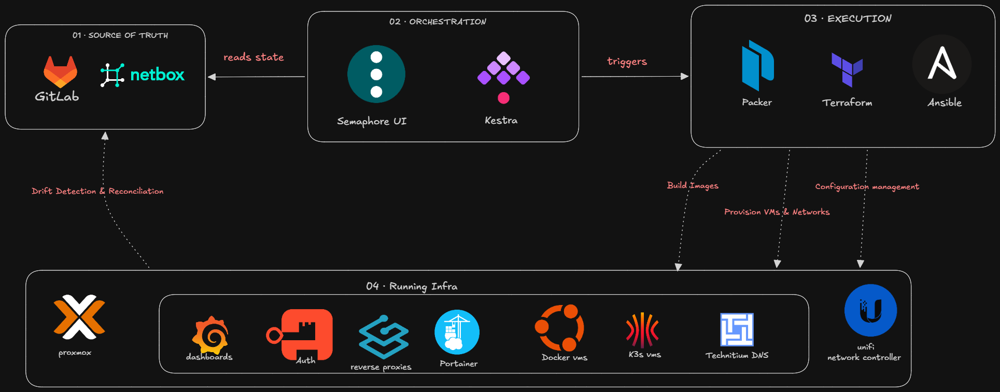

> homelab automation overview

Automation takes time and effort to build. Click-ops does not survive past one rebuild. The lab exists to make that lesson cheap to learn and easy to repeat.

---

### Automation Tools

| Tool | Role | What it does |
|---|---|---|
|  [Terraform](https://terraform.io) | Provision infrastructure | Declarative state — "I want 3 VMs with these specs." Idempotent |
|  [Ansible](https://ansible.com) | Configure systems | Procedural runbook. SSH-based, no agent required |
|  [Packer](https://packer.io) | Build base images | Make a golden image once, use it 100 times |
|  [Kestra](https://kestra.io) | Orchestrate workflows | Triggers on Git push, schedule, or webhook. Coordinates multi-tool pipelines |
|  [Semaphore UI](https://semaphoreui.com) | Terraform and Ansible UI | Web interface for running plans and playbooks with a full audit trail |
|  [GitLab CE](https://about.gitlab.com) | Code and CI/CD | Source of truth for everything code-shaped. MR-based Terraform |
|  [NetBox](https://netboxlabs.com/) | Source of truth | What devices exist, what IPs they have, what VLANs they're on |
|  [MaaS](https://canonical.com/maas) | Bare metal provisioning | PXE / IPMI bare-metal lifecycle. Bridges the gap below the hypervisor |

**NetBox as source of truth**

NetBox stores the desired state of the lab. Every device, IP address, VLAN, and prefix lives here. Automation tools query NetBox to know what should exist. The UniFi-to-NetBox sync runs as a container triggered by a Kestra workflow, keeping device records and IP assignments up to date automatically.

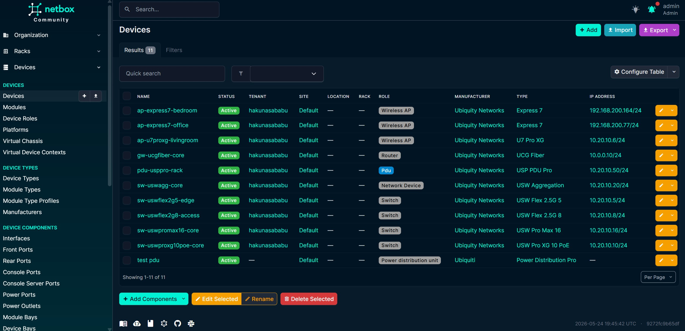
 > NetBox- device inventory overview 

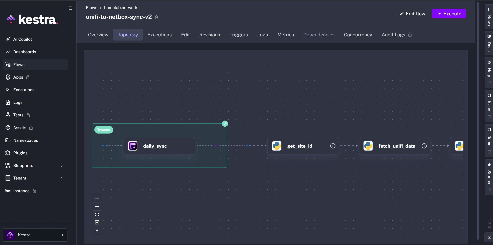
 > UniFi to NetBox sync — Kestra workflow

**Kestra — VM provisioning and NetBox documentation flow**

Kestra orchestrates the full VM lifecycle: trigger on Git push → Terraform provisions the VM from a cloud-init template → Ansible configures the application → NetBox record is updated with the new VM's IP, hostname, and status. The whole sequence runs without manual steps.

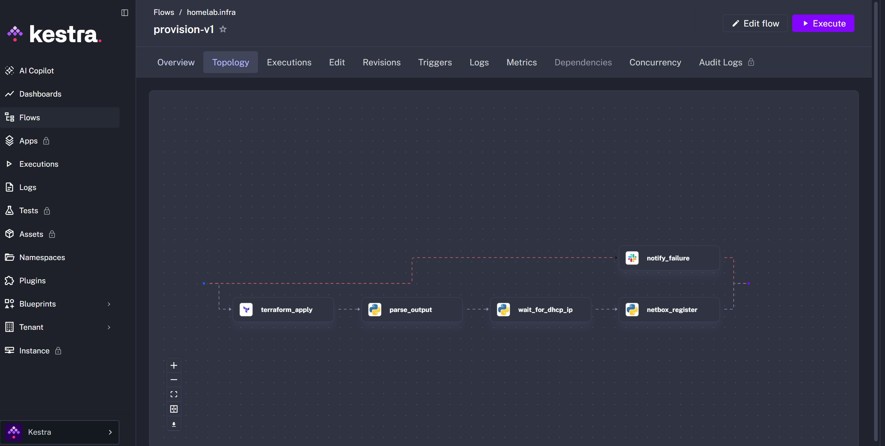
 > Kestra VM provisioning workflow

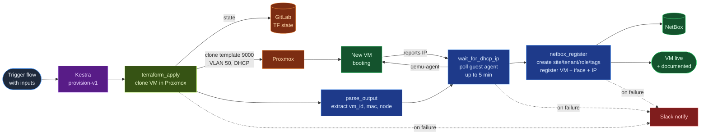
```mermaid
flowchart LR
    User([Trigger flow<br/>with inputs]) --> Kestra[Kestra<br/>provision-v1]

    Kestra --> T1[terraform_apply<br/>clone VM in Proxmox]
    T1 -->|state| GitLab[(GitLab<br/>TF state)]
    T1 -->|clone template 9000<br/>VLAN 50, DHCP| PVE[Proxmox]

    PVE --> VM[New VM<br/>booting]

    T1 --> T2[parse_output<br/>extract vm_id, mac, node]

    T2 --> T3[wait_for_dhcp_ip<br/>poll guest agent<br/>up to 5 min]
    T3 -->|qemu-agent| VM
    VM -->|reports IP| T3

    T3 --> T4[netbox_register<br/>create site/tenant/role/tags<br/>register VM + iface + IP]
    T4 --> NetBox[(NetBox)]

    T4 --> Done([VM live<br/>+ documented])

    T1 -.->|on failure| Slack[Slack notify]
    T3 -.->|on failure| Slack
    T4 -.->|on failure| Slack

    style User fill:#1e293b,stroke:#60a5fa,color:#e2e8f0
    style Done fill:#14532d,stroke:#4ade80,color:#dcfce7
    style VM fill:#14532d,stroke:#4ade80,color:#dcfce7
    style Kestra fill:#581c87,stroke:#c084fc,color:#e9d5ff
    style T1 fill:#365314,stroke:#a3e635,color:#ecfccb
    style T2 fill:#1e3a8a,stroke:#60a5fa,color:#dbeafe
    style T3 fill:#1e3a8a,stroke:#60a5fa,color:#dbeafe
    style T4 fill:#1e3a8a,stroke:#60a5fa,color:#dbeafe
    style PVE fill:#7c2d12,stroke:#fb923c,color:#fed7aa
    style GitLab fill:#7c2d12,stroke:#fb923c,color:#fed7aa
    style NetBox fill:#14532d,stroke:#4ade80,color:#dcfce7
    style Slack fill:#7f1d1d,stroke:#f87171,color:#fecaca
```
 >  VM provisioning workflow

**Semaphore — Terraform VM create and bootstrap**

Semaphore provides a web interface for running Terraform plans and Ansible playbooks with a full audit trail. VM creation goes through Semaphore so there is a record of who ran what, when, and what the output was.

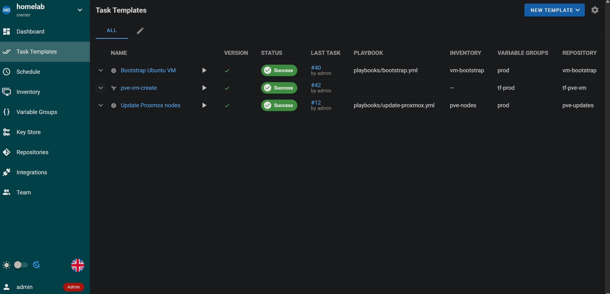
> Semaphore ui overview 


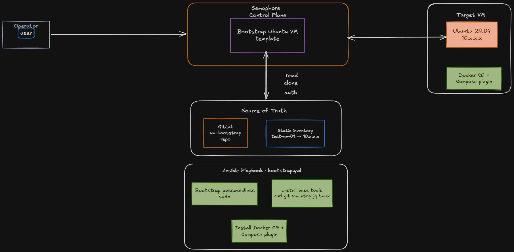
  > Ansible workflow
---

## IoT and Home Automation

 [Home Assistant](https://www.home-assistant.io) runs as a dedicated VM on the Proxmox cluster, isolated on VLAN 20 (IOT). It manages the smart home layer: Tapo smart plugs with power monitoring, temperature and humidity sensors, smart bulbs, and presence detection.

All sensor data flows into InfluxDB, where Grafana picks it up for dashboards and alerting.

IoT devices have well-documented security weaknesses. I have all the IoT devices on a dedicated VLAN with deny-all inter-VLAN rules, which limits the blast radius of any compromise to the IoT subnet. Home Assistant is the only host permitted to communicate with IoT devices, and that rule is enforced in the UniFi firewall rules.

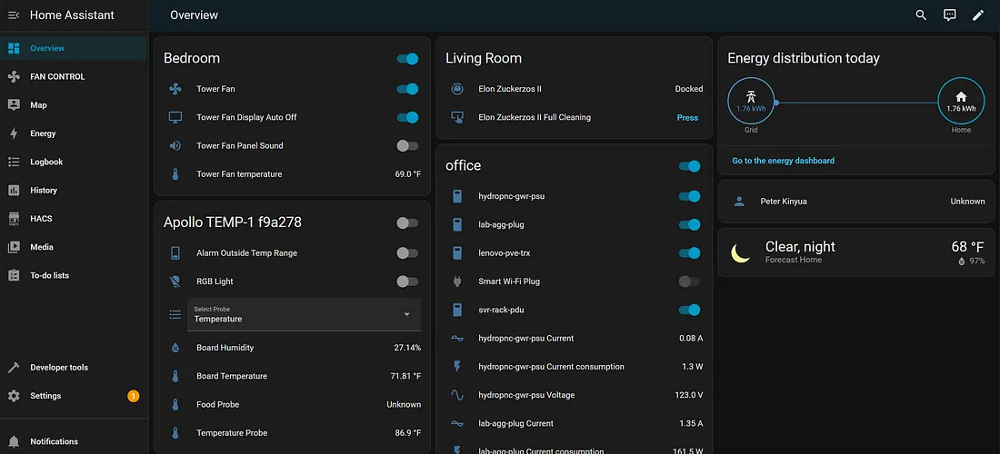

> Home Assistant dashboard]
---

## Observability

Metrics and logs flow from everything that matters into one place, and Grafana paints the picture.

**Sources feeding the pipeline:**

- Apps: Home Assistant, \*arr stack, Jellyfin, DNS server
- Network devices: UniFi switches and APs via SNMP and the unpoller exporter
- Infrastructure: Proxmox nodes, IoT sensors, Tapo smart plugs

---

### Observability Matrix — InfluxDB + Telegraf Path

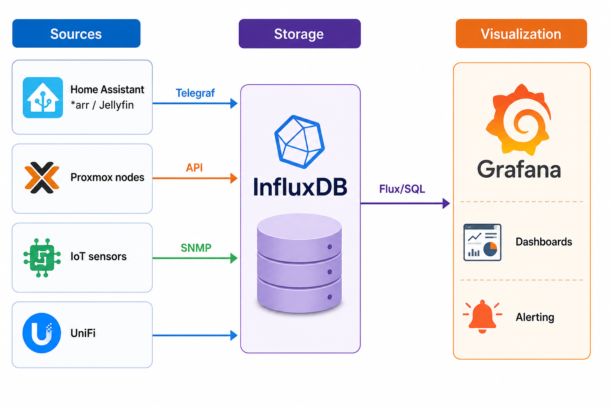
> InfluxDB + Grafana


| Component | Role |
|---|---|
|  [InfluxDB](https://www.influxdata.com) | Time-series storage. High write throughput, tag-based queries, buckets, long-term retention |
|  [Telegraf](https://www.influxdata.com/time-series-platform/telegraf/) | Agent-based collection from hosts, Docker containers, SNMP targets, and Home Assistant |
|  [Grafana](https://grafana.com) | Dashboards and alerting across all data sources |

**Glances dashboard**

 [Glances](https://github.com/glanceapp/glance/) provides a real-time system-level view of each host. It runs on every node and exposes a summary that feeds into the main Grafana instance.

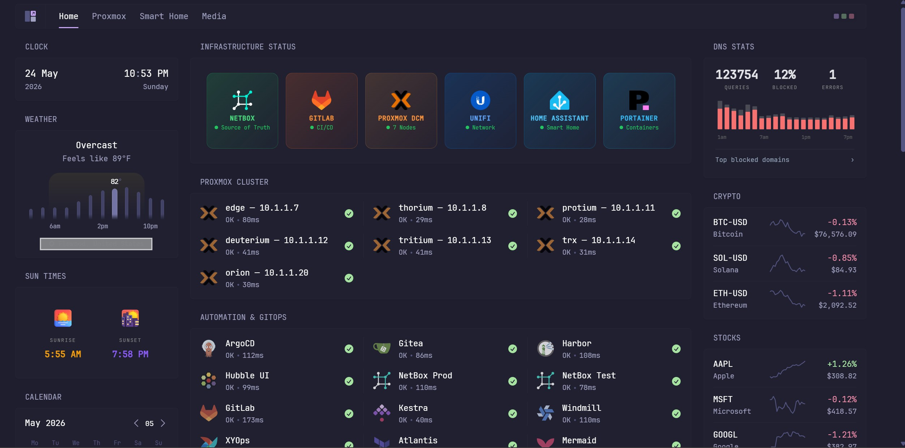
 > Glance dashboard 


**Grafana + InfluxDB — Home Assistant metrics**

Smart plug power consumption, temperature sensors, humidity, and presence data from Home Assistant flow into InfluxDB via the native InfluxDB integration. Grafana shows per-room trends, power per device, and anomaly alerts.

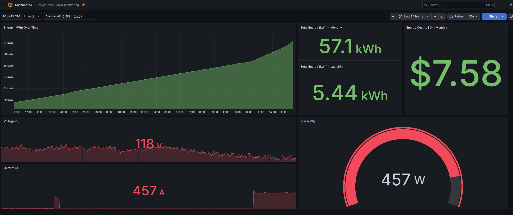
> Grafana InfluxDB Home Assistant metrics

**Proxmox metrics**

Proxmox metrics in Grafana using InfluxDB as a data source.

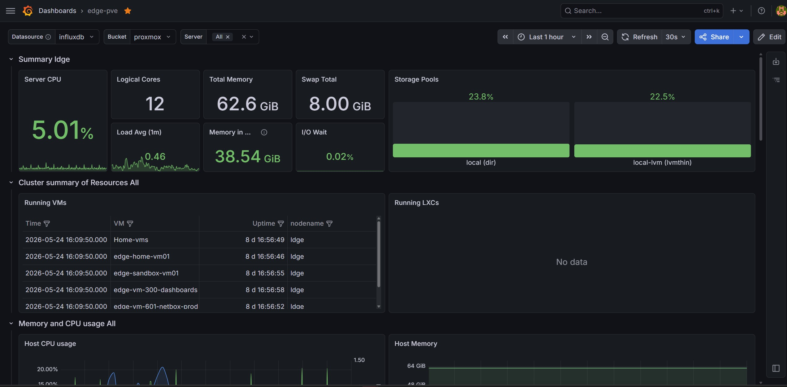
> Proxmox metrics in Grafana

**Traefik log dashboard**

 [Traefik](https://traefik.io) is the reverse proxy for all Docker-hosted services. Its access logs flow into Loki, and Grafana visualises per-service request rates, error rates, and response latency.

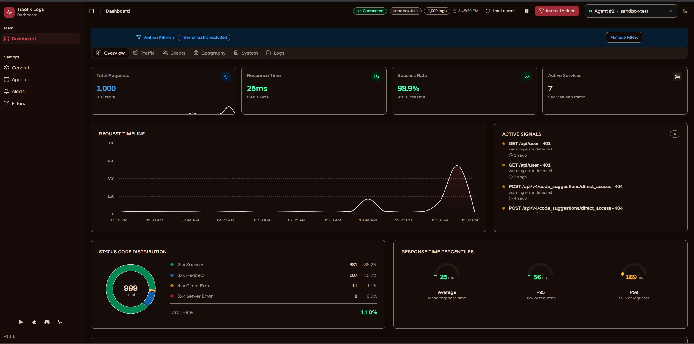
 >Traefik log dashboard

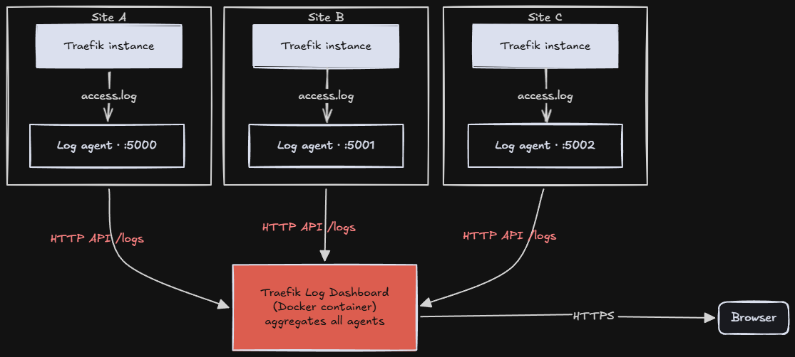
>Traefik logs aggregation 

**Zabbix setup**

 [Zabbix](https://www.zabbix.com) runs on the Firebat mini PC in Docker in kiosk mode. It handles agent-based monitoring for nodes where SNMP is insufficient, IoT device availability checks, and anything that benefits from Zabbix's built-in templating and escalation engine.

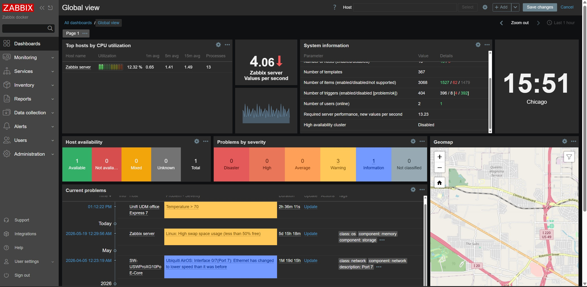
> Zabbix dashboard
---

### Observability Matrix — Prometheus Path

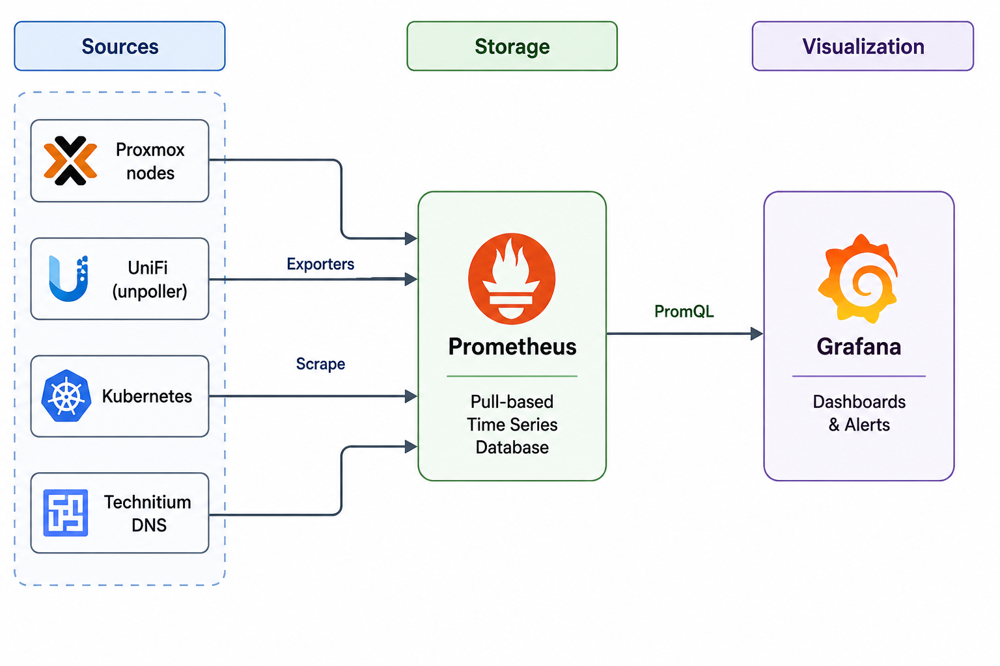
> Prometheus + Grafana stack


| Component | Role |
|---|---|
|  [Prometheus](https://prometheus.io) | Pull-based metric collection. Label-based queries via PromQL, long-term storage |
| [node_exporter](https://github.com/prometheus/node_exporter) | Host-level metrics — CPU, memory, disk, network interfaces |
| [proxmox-pve-exporter](https://github.com/prometheus-pve/prometheus-pve-exporter) | Proxmox node and VM metrics via the PVE API |
| [unpoller](https://github.com/unpoller/unpoller) | UniFi device metrics — client counts, AP signal, switch port counters, traffic rates |
| [kube-state-metrics](https://github.com/kubernetes/kube-state-metrics) | Kubernetes object state — deployments, pods, persistent volumes |
|  [Grafana](https://grafana.com) | Dashboards and alerting |

**UniFi metrics to Prometheus and Grafana**

unpoller scrapes the UniFi controller API and exposes metrics in Prometheus format. Grafana renders per-AP client counts, signal strength, channel utilisation, and per-port switch traffic.

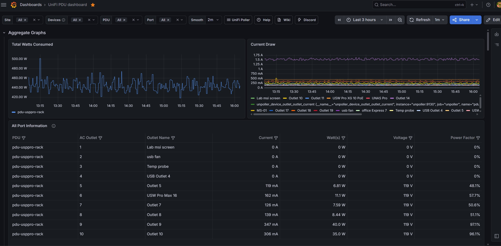
> UniFi metrics in Grafana
**Technitium DNS metrics**

Technitium exposes a Prometheus-compatible metrics endpoint natively. Prometheus scrapes query counts, cache hit rates, blocked domain counts, and resolver latency. Useful for verifying that Pi-hole and Technitium are working correctly in tandem.

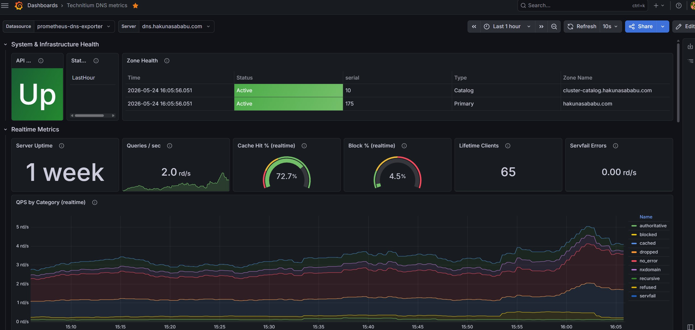
> Technitium metrics in Grafana
---

## Selfhosting

### Why This Matters 

There is a broader shift happening.Due to Privacy and cost factors, more organisations are moving toward self-hosted and on-premises solutions. The open-source ecosystem has matured to the point where almost every major cloud service has a viable self-hosted equivalent. Some useful directories:

- [selfh.st/apps](https://selfh.st/apps/) — comprehensive directory of self-hosted alternatives
- [awesome-selfhosted](https://github.com/awesome-selfhosted/awesome-selfhosted) — comprehensive git repo of self-hosted alternatives
- [Project Nomad](https://www.projectnomad.us/#features) — infrastructure tooling for self-hosted environments

Understanding both sides — cloud and on-prem, managed and self-hosted can also help in making the right architectural decisions rather than defaulting to the path of least resistance.

---

## For Network Engineers

This section is for Tools I have tested and used to learn routing and switching

---

### Network Sandboxes and Emulators

For practising protocols, building exam topologies, and running real NOS images without physical hardware.

**Images I run**

| Image | Use case | Where it runs |
|---|---|---|
| MikroTik RouterOS (CHR) | BGP, MPLS, OSPF, VPLS labs | EVE-NG, PNetLab |
| OpenWrt | Wireless protocol testing, package routing, WDS mesh | EVE-NG, physical AP |
| OPNsense / pfSense | Firewall, IPsec, OpenVPN, HAProxy | EVE-NG, Proxmox VM |
| FRRouting (FRR) | BGP, OSPF, IS-IS, OpenFabric, EVPN | Containerlab, bare Proxmox LXC |

**Emulator platforms**

| Tool | Type | Notes |
|---|---|---|
| [EVE-NG](https://www.eve-ng.net) | Network emulator | Industry standard. Runs Cisco IOSv, Junos, Arista vEOS, Palo Alto. Community edition free |
|  [PNetLab](https://pnetlab.com) | Network emulator | EVE-NG fork with better UI and community lab sharing. Used here for Juniper JNCIS prep |
|  [Containerlab](https://containerlab.dev) | Container-based emulator | Topologies defined in YAML. Works with Nokia SR Linux (free), FRRouting, VyOS, cEOS. GitOps-native |
|  [GNS3](https://www.gns3.com) | Network emulator | Long-standing open-source emulator. Massive community and plugin ecosystem |
|  [Cisco Modeling Labs](https://www.cisco.com/c/en/us/products/cloud-systems-management/modeling-labs/index.html) | Network emulator | CML Personal is free (20 node limit). Best IOS XE / IOS XR fidelity |


**Which one to use:**

- EVE-NG or PNetLab for Cisco / Juniper / multi-vendor exam prep with real images
- Containerlab for open-source networking (FRR, SR Linux, VyOS) and GitOps-style lab-as-code
- GNS3 if the community resource library matters more than topology portability

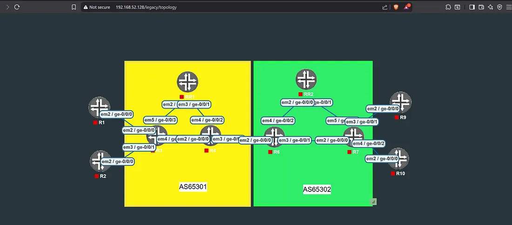

> Topology in PNetLab 

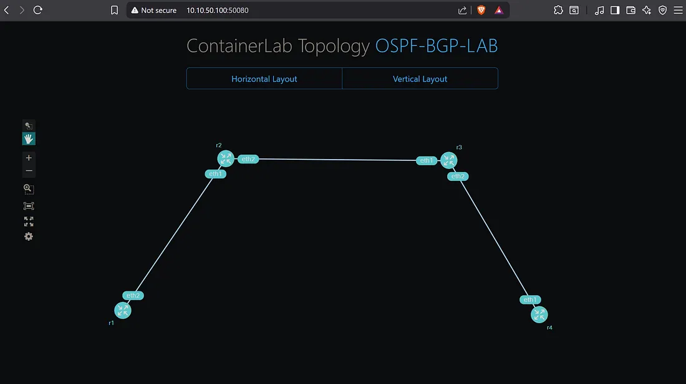
> Topology in Containerlabs
---

### Open Source NMS Tools

Tools for monitoring, alerting, and visualising your network's health. All open source or free tier.

| Tool | Type | Notes |
|---|---|---|
|  [Zabbix](https://www.zabbix.com) | Full-stack NMS | Auto-discovery, SNMP, agent-based, extensive template library. Running here in Docker |
|  [LibreNMS](https://www.librenms.org) | SNMP-based NMS | Auto-discovery, topology maps, alerting, free forever. Best open-source SolarWinds alternative |
|  [OpenNMS](https://www.opennms.com) | Enterprise NMS | NetFlow, sFlow, IPFIX analysis, fault management, service monitoring |
|  [Nagios Core](https://www.nagios.org) | Check-based monitoring | The original. Vast plugin ecosystem. Steeper setup than modern alternatives |
| [NetXMS](https://www.netxms.org) | Full-stack NMS | SNMP, agent, topology maps, event correlation. Less known, very capable |
|  [Icinga 2](https://icinga.com) | Nagios fork | Better UI, REST API, modern config language |
|  [Smokeping](https://oss.oetiker.ch/smokeping/) | Latency monitoring | Round-trip time and packet loss over time. Irreplaceable for WAN and ISP monitoring |

---

### Observability Tools for Networking

Network-specific visibility: traffic flows, interface metrics, protocol state, and latency.

| Tool | Purpose |
|---|---|
|  [Grafana](https://grafana.com) | Dashboards and alerting across all network metric sources |
|  [Prometheus](https://prometheus.io) | Pull-based collection via SNMP exporter, node exporter, unpoller |
|  [InfluxDB](https://www.influxdata.com) | Time-series storage, better for high-cardinality IoT and sensor data |
| SNMP Exporter | Translates standard MIBs (ifTable, ifXTable) into Prometheus metrics |
|  [ntopng](https://www.ntop.org) | Real-time traffic and flow analysis |
|  [Loki](https://grafana.com/oss/loki/) | Log aggregation. Grafana-native, lightweight Elastic alternative |
| [Alertmanager](https://prometheus.io/docs/alerting/alertmanager/) | Prometheus alert routing to Slack, ntfy, PagerDuty, email |
|  [Uptime Kuma](https://uptime.kuma.pet) | HTTP, TCP, DNS, ping uptime checks with a clean self-hosted UI |

---

## Learning Roadmap

The roadmap covers the progression from first Linux server to full infrastructure automation, with parallel tracks for networking, virtualisation, and cloud.

[View my homelab roadmap on roadmap.sh](https://roadmap.sh/r/homelab-9b4ql)

**Phase 1 — Foundation.** Single machine. Docker Compose. One service. Learn Linux, SSH, reverse proxies, DNS.

**Phase 2 — Networking.** Managed switch. VLANs. Firewall rules. DHCP reservations. Static routes. The point where most people stop. Do not stop here.

**Phase 3 — Platform.** Proxmox. VM lifecycle. Cloud-init templates. k3s. Ceph. T

**Phase 4 — Automation.** NetBox as source of truth. Terraform provisioning. Ansible configuration. GitLab CI/CD. Kestra orchestration. The lab rebuilds itself from Git.

---

## Takeaways

**1. Start small.**
One machine. One service. Solve one problem. Do not buy a rack first.

**2. Hardware is rarely the bottleneck.**
Understand your problem before buying hardware. The Threadripper came after I understood what I needed it for.

**3. Networking is where homelabs differentiate.**
VLANs first, then maybe routed fabrics. The foundation of your homelab is the network, and maybe DNS. Every other problem eventually traces back here.

**4. Automate everything you would hate to redo.**
Manual before automating — understand it, then automate it. Click-ops does not survive your second rebuild. The first time you destroy your cluster and rebuild it from Git, you become a different kind of engineer.

**5. Tell your story.**
A homelab can be a project portfolio.

---

Built by [Peter Kinyua](https://medium.com/@peter_kinyua)